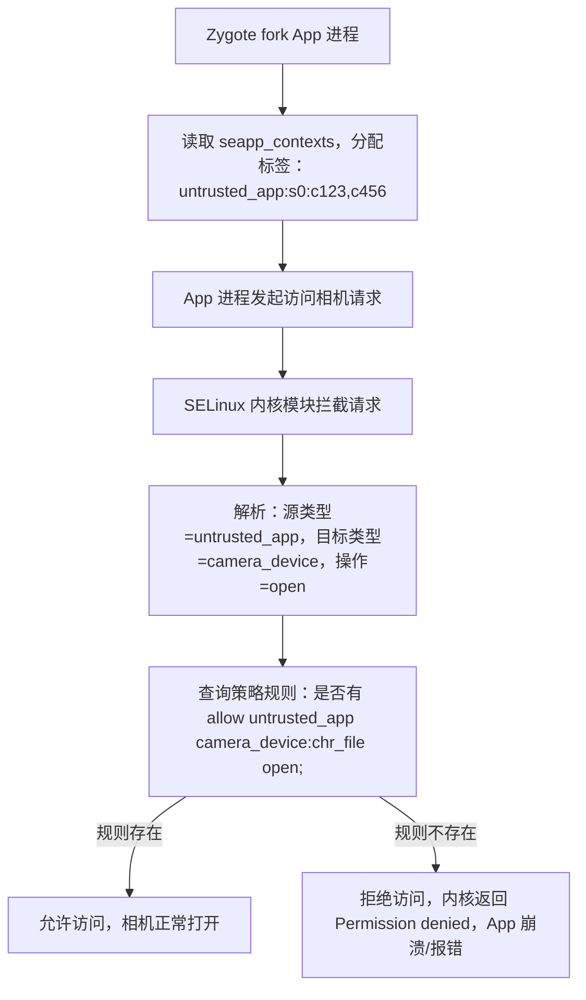

[TOC]

# Android SELinux 对进程的具体配置逻辑

你想了解 Android SELinux 对进程的具体配置逻辑，核心结论是：Android SELinux 为每个进程分配**安全标签（Security Label）**，并通过预定义的策略规则（Policy Rules）强制管控进程的访问行为，从进程创建到运行全程实现权限隔离，且配置逻辑分为「标签分配」和「策略管控」两大核心环节。

下面从**标签分配、策略规则、生效流程、配置验证**四个维度详细拆解：

### 一、核心基础：SELinux 进程安全标签（Context）
Android SELinux 对进程的管控，首先是给每个进程分配唯一的**安全标签（也叫 Security Context/SELinux Context）**，标签格式为：
```
user:role:type:level
```
- **user**：SELinux 用户（如 `u` 代表普通用户，`root` 代表根用户）；
- **role**：角色（Android 中几乎只用 `r`，代表 `role`）；
- **type**：类型（核心！进程的核心标识，如 `app_process`、`system_server`、`untrusted_app`）；
- **level**：MLS/MCS 级别（Android 中主要用于多用户隔离，如 `s0:c123,c456`）。

#### 1. 进程标签的分配规则（谁来给进程贴标签？）
Android 进程的 SELinux 标签不是手动设置的，而是**系统在进程创建时自动分配**，分配逻辑分三类场景：

| 进程类型                                  | 标签分配时机                                | 分配依据                                          | 示例标签                                       |
| ----------------------------------------- | ------------------------------------------- | ------------------------------------------------- | ---------------------------------------------- |
| 系统核心进程（如 init、system_server）    | Android 启动阶段（init 进程 fork 子进程时） | `init.rc` 脚本中的 `seclabel` 指令                | `u:r:system_server:s0`（system_server 进程）   |
| 系统服务进程（如 surfaceflinger、zygote） | 进程启动时由 init 进程指定                  | 编译时固化的 `file_contexts` + `service_contexts` | `u:r:surfaceflinger:s0`（surfaceflinger 进程） |
| 普通 App 进程（第三方 App）               | Zygote 进程 fork App 进程时                 | App 的 UID + `seapp_contexts` 配置文件            | `u:r:untrusted_app:s0:c123,c456`（普通 App）   |
| adb shell 进程                            | 执行 `adb shell` 时                         | `service_contexts` + `shell_contexts`             | `u:r:shell:s0`（shell 进程）                   |

#### 2. 关键配置文件（标签分配的核心依据）
Android **编译**时会将标签分配规则固化到以下文件（运行时只读，路径：`/system/etc/selinux/`）：
- **`seapp_contexts`**：核心！定义 App/系统进程的标签规则，示例内容：
  
  ```
  # 普通 App 进程（UID 10000+）分配 untrusted_app 类型
  user=app domain=untrusted_app uid=10000-19999
  # system 权限 App（UID=1000）分配 system_app 类型
  user=system domain=system_app uid=1000
  # 系统服务进程（如 media）分配 media_server 类型
  user=media domain=media_server uid=1013
  ```
- **`service_contexts`**：定义系统服务名称与标签的映射，示例：
  ```
  surfaceflinger    u:object_r:surfaceflinger_service:s0
  zygote            u:object_r:zygote_service:s0
  ```
- **`init.rc`**：系统启动脚本，给 init 启动的进程指定标签，示例：
  ```rc
  service system_server /system/bin/system_server
      class core
      user system
      seclabel u:r:system_server:s0  # 强制指定标签
  ```

### 二、核心管控：SELinux 策略规则（Process 能做什么？）
给进程分配标签后，SELinux 通过**策略规则（Policy Rules）** 定义「哪些进程（源标签）可以访问哪些资源（目标标签）」，规则是 Android SELinux 管控进程的核心，存储在 `/system/etc/selinux/plat_sepolicy.cil`（编译后的二进制策略文件）。

#### 1. 策略规则的核心语法
规则基于「源类型（进程）→ 目标类型（资源）→ 权限」的逻辑，基本格式：
```cil
allow 源进程类型 目标资源类型:资源类别 权限;
```
- **源进程类型**：进程的 SELinux type（如 `untrusted_app`）；
- **目标资源类型**：被访问资源的 type（如 `camera_device`、`app_data_file`）；
- **资源类别**：资源类型（如 `file`、`device`、`socket`）；
- **权限**：允许的操作（如 `read`、`write`、`open`）。

#### 2. 进程管控的典型规则示例
```cil
# 允许 system_server 进程（system_server 类型）读写系统数据文件（system_data_file 类型）
allow system_server system_data_file:file { read write open };

# 允许普通 App 进程（untrusted_app 类型）访问相机设备（camera_device 类型）
allow untrusted_app camera_device:chr_file { read write ioctl };

# 禁止 App 进程访问 system_server 的进程内存（核心隔离！）
neverallow untrusted_app system_server:process ptrace;
```

#### 3. 关键规则类型（进程管控的核心手段）
| 规则类型          | 作用                                        | 示例                                                  |
| ----------------- | ------------------------------------------- | ----------------------------------------------------- |
| `allow`           | 允许进程执行某操作（基础规则）              | 允许 App 读自己的 data 文件                           |
| `deny`            | 拒绝进程执行某操作（优先级低于 neverallow） | 拒绝 App 写系统目录                                   |
| `neverallow`      | 强制禁止（最高优先级，无法覆盖）            | 禁止所有 App ptrace 系统进程                          |
| `type_transition` | 进程切换时自动变更标签（如 App 启动子进程） | App 进程 fork 子进程时，子进程仍为 untrusted_app 类型 |

### 三、进程管控的完整生效流程（从启动到访问）
以「普通 App 进程访问相机」为例，拆解 SELinux 对进程的管控流程：


#### 关键细节：
1. **SELinux 工作模式**：Android 默认为 `Enforcing`（强制模式），所有进程访问都必须符合规则；调试时可临时切 `Permissive`（宽容模式，仅日志不拒绝）；
2. **权限继承**：进程 fork 子进程时，子进程默认继承父进程的 SELinux 标签（除非有 `type_transition` 规则指定新标签）；
3. **root 进程也受限**：即使进程是 root UID（Linux 层面），若 SELinux 策略不允许，仍无法访问资源（如 root 进程无法访问 `untrusted_app` 的 data 文件）。

### 四、进程 SELinux 配置的验证与调试（实用命令）
你可以通过以下命令验证进程的 SELinux 配置，适配 Android 10+ 所有版本：
```bash
# 1. 查看指定进程的 SELinux 标签（以 system_server 为例）
adb shell ps -Z | grep system_server
# 输出示例：u:r:system_server:s0   system   1234  1  system_server

# 2. 查看 SELinux 工作模式（Enforcing/Permissive）
adb shell getenforce
# 临时切换为宽容模式（需 root）：adb shell setenforce 0

# 3. 查看进程访问被拒绝的日志（SELinux avc 报错）
adb shell dmesg | grep avc:
# 或 adb logcat | grep avc

# 4. 查看策略规则（需 root + 工具）
# 安装 setools 工具：adb install setools.apk
adb shell seinfoallow untrusted_app camera_device chr_file open
# 输出：是否允许 untrusted_app 访问 camera_device 的 open 权限
```

### 五、核心差异：Android SELinux vs Linux SELinux 进程管控
| 维度       | Android SELinux                                 | 通用 Linux SELinux                 |
| ---------- | ----------------------------------------------- | ---------------------------------- |
| 标签分配   | 自动分配（seapp_contexts/init.rc）              | 手动配置（useradd -Z）             |
| 核心类型   | 按 App/服务分类（untrusted_app、system_server） | 按用户/服务分类（httpd_t、sshd_t） |
| 规则灵活性 | 编译时固化，运行时不可修改                      | 支持运行时加载模块（semodule）     |
| 管控重点   | 进程沙箱隔离（App 间/App 与系统）               | 进程权限最小化（服务进程）         |

### 总结
1. Android SELinux 对进程的管控核心是「**标签分配 + 策略规则**」：标签定义进程身份，规则定义进程权限；
2. 标签由 `seapp_contexts`/`init.rc` 自动分配，规则固化在 `plat_sepolicy.cil` 中，运行时只读；
3. 即使是 root 进程，也必须遵守 SELinux 策略，这是 Android 进程沙箱的核心保障；
4. 普通 App 进程默认被标记为 `untrusted_app`，仅能访问自身资源和授权的系统资源，大幅缩小故障的 blast radius。

如果需要，我可以整理一份 **Android 常见进程 SELinux 标签速查表**（包含 system_server、App、shell 等核心进程），或 **SELinux 进程权限排查步骤**，方便你快速定位进程访问被拒的问题。


# MLS/MCS 解釋比較

你想了解 SELinux 中 MLS 和 MCS 的区别与联系，核心结论是：**MLS（多级安全）是面向高安全等级场景的经典模型，MCS（多类别安全）是 MLS 的轻量化简化版**，Android 系统中主要使用 MCS 而非完整 MLS，用于实现 App/用户的细粒度隔离。

下面从**定义、核心设计、适用场景、Android 落地**四个维度详细对比解释：

### 一、核心定义与设计目标
| 概念    | 英文全称                | 中文翻译   | 核心设计目标                                                 | 核心特征                                                     |
| ------- | ----------------------- | ---------- | ------------------------------------------------------------ | ------------------------------------------------------------ |
| **MLS** | Multi-Level Security    | 多级安全   | 满足军事/涉密系统的“强制访问控制”需求，严格按“安全级别”管控数据流向 | 基于**等级（Level）+ 范畴（Category）**，遵循“下读上写”（No Read Up, No Write Down，NRU/NWD）规则 |
| **MCS** | Multi-Category Security | 多类别安全 | 轻量化替代 MLS，仅保留“范畴”维度，无严格等级限制，适配通用场景的隔离需求 | 仅基于**范畴（Category）**，无等级约束，核心是“相同范畴才能访问” |

### 二、核心机制拆解（对比理解）
#### 1. MLS（多级安全）：等级+范畴的严格管控
MLS 是为军工、政府等高安全场景设计的模型，核心是给主体（进程）和客体（文件）分配「安全等级 + 范畴」，并强制遵守数据流向规则：
- **安全等级（Level）**：有明确的高低顺序，如 `Top Secret（绝密）> Secret（机密）> Confidential（秘密）> Unclassified（非密）`；
- **范畴（Category）**：无顺序的分类标签，如 `Finance、Military、Medical`；
- **核心规则（NRU/NWD）**：
  - ❌ No Read Up：低等级进程不能读取高等级资源（如“秘密”进程不能读“机密”文件）；
  - ❌ No Write Down：高等级进程不能写入低等级资源（如“机密”进程不能写“秘密”文件）；
  - ✅ 仅允许同等级/同范畴的进程访问对应资源。

**示例（军事场景）**：
- 进程标签：`u:r:military_process:s0:c100,c200 [Secret, Army]`（等级：Secret，范畴：Army）；
- 文件标签：`u:object_r:military_file:s0:c100,c200 [Secret, Army]` → 允许访问；
- 文件标签：`u:object_r:military_file:s0:c100,c300 [Top Secret, Navy]` → 拒绝访问（等级更高+范畴不同）。

#### 2. MCS（多类别安全）：仅范畴的轻量化隔离
MCS 是 SELinux 为通用场景（如服务器、移动端）对 MLS 的简化，**移除了“等级”维度，仅保留“范畴”**：
- 无等级高低之分，范畴仅作为“隔离标签”；
- 核心规则：**只有主体和客体的范畴完全匹配（或包含），才能访问**；
- 范畴用数字标识（如 `c123,c456`），可随机分配，无业务含义。

**示例（通用服务器场景）**：
- 进程标签：`u:r:web_process:s0:c123`（范畴：c123）；
- 文件标签：`u:object_r:web_file:s0:c123` → 允许访问；
- 文件标签：`u:object_r:db_file:s0:c456` → 拒绝访问（范畴不匹配）。

### 三、MLS vs MCS 核心差异总结
| 对比维度 | MLS（多级安全）                        | MCS（多类别安全）                          |
| -------- | -------------------------------------- | ------------------------------------------ |
| 核心维度 | 等级（Level）+ 范畴（Category）        | 仅范畴（Category）                         |
| 访问规则 | 严格的“下读上写”（NRU/NWD）            | 仅“范畴匹配”即可访问                       |
| 适用场景 | 军工、政府、涉密系统（高安全等级需求） | 通用服务器、移动端（仅需隔离，无等级需求） |
| 复杂度   | 高（需维护等级体系、流向规则）         | 低（仅需分配范畴标签）                     |
| 灵活性   | 低（规则固定，无法灵活调整）           | 高（范畴可随机分配，适配动态隔离）         |
| 典型落地 | 美国国防部系统、涉密政务系统           | Android、Linux 服务器、Docker/K8s          |

### 四、Android 中的落地：仅用 MCS，无 MLS
Android 作为移动端系统，无需 MLS 的“等级管控”，仅用 MCS 实现细粒度隔离，核心用法：
#### 1. MCS 范畴的分配规则
- Android 为每个 App/用户分配**随机的 MCS 范畴（cxxx）**，标签格式如：`u:r:untrusted_app:s0:c123,c456`；
- 范畴由 `seapp_contexts` 配置文件控制，示例：
  ```
  # 普通 App 分配随机范畴（c0-c1023）
  user=app domain=untrusted_app uid=10000-19999 mlstrustedsubject mlscategory=0-1023
  ```
#### 2. MCS 在 Android 中的核心作用
- **App 间隔离**：不同 App 分配不同范畴，即使 SELinux type 相同（如都是 `untrusted_app`），范畴不同也无法互相访问数据；
- **多用户隔离**：同一设备的不同 User Profile 分配不同范畴段，避免跨用户数据泄露；
- **缩小 blast radius**：即使某 App 被入侵，MCS 范畴限制其只能访问自身资源，无法扩散到其他 App/用户。

#### 3. 验证 Android MCS 范畴的命令
```bash
# 1. 查看某 App 进程的 MCS 范畴（最后一段）
adb shell ps -Z | grep com.example.app
# 输出示例：u:r:untrusted_app:s0:c123,c456  u0_a123  4567  ...

# 2. 查看文件的 MCS 范畴
adb shell ls -Z /data/data/com.example.app/files/test.txt
# 输出示例：u:object_r:app_data_file:s0:c123,c456  test.txt
```

### 总结
1. **MLS** 是“重量级”安全模型，含等级+范畴，遵循严格的流向规则，适配高安全等级场景；
2. **MCS** 是 MLS 的“轻量化简化版”，仅保留范畴维度，无等级约束，适配通用隔离场景；
3. Android 仅使用 MCS 而非 MLS，通过随机分配的范畴标签（cxxx）实现 App/用户的细粒度隔离，是 SELinux 进程沙箱的重要补充。

如果需要，我可以整理一份 **Android MCS 范畴配置与调试指南**，包含范畴分配规则修改、隔离问题排查的具体步骤，需要吗？


# u:r:untrusted_app:s0:c123,c456 中123,c456誰分配? 有特別含義?

你关注的 `u:r:untrusted_app:s0:c123,c456` 中的 `c123,c456` 是 Android SELinux MCS 范畴标签，核心结论是：**这些数字由 Android 系统在 App 安装/进程启动时自动随机分配，无业务层面的特殊含义，仅作为“隔离标识”实现 App 间的细粒度隔离**。

下面详细拆解分配主体、规则和数字的含义：

### 一、谁来分配 c123,c456？（分配主体+时机）
`cxxx` 范畴数字的分配由 Android 系统的 **PackageManagerService (PMS)** + **SELinux 子系统** 共同完成，分两个关键时机：
#### 1. App 安装时：分配“永久范畴段”
当你安装 App 时，PMS 会：
1. 读取 `/data/system/packages.xml`（App 安装信息库），为该 App 分配一个 **唯一的 UID**（如 10123）；
2. 根据 UID 从预设的 MCS 范畴池（默认 `c0-c1023` 或 `c0-c65535`）中，**随机选取一组未被使用的范畴数字**（如 `c123,c456`）；
3. 将「App 包名 ↔ UID ↔ MCS 范畴」的对应关系写入 `packages.xml` 持久化存储；
   - 示例 `packages.xml` 片段：
     ```xml
     <package name="com.example.app" uid="10123" ...>
         <seinfo>default:targetSdkVersion=34:mcs=123,456</seinfo>
     </package>
     ```

#### 2. App 进程启动时：绑定范畴标签
当 App 启动（Zygote fork 进程）时：
1. Zygote 进程读取 `packages.xml` 中该 App 的 MCS 范畴配置；
2. 结合 `seapp_contexts` 中的规则（如 `mlscategory=0-1023`），将范畴数字拼接进 SELinux 标签；
3. 最终生成完整标签：`u:r:untrusted_app:s0:c123,c456`，并绑定到 App 进程。

### 二、c123,c456 有特别含义吗？（核心：无业务含义，仅隔离）
这些数字**没有任何业务/功能层面的特殊含义**，设计初衷就是“无意义的随机数”，核心作用只有两个：
#### 1. 核心作用：App 间的“强隔离”
即使两个 App 的 SELinux `type` 相同（都是 `untrusted_app`）、Linux UID 不同，只要 `cxxx` 范畴不匹配，SELinux 就会拒绝它们互相访问资源：
- App A 标签：`u:r:untrusted_app:s0:c123,c456` → 只能访问标有 `c123,c456` 的文件/设备；
- App B 标签：`u:r:untrusted_app:s0:c789,c000` → 无法访问 App A 的资源（范畴不匹配）；
- 补充：范畴支持“多值”（如 `c123,c456`），是为了适配 App 共享 UID（`sharedUserId`）场景——共享 UID 的 App 会分配相同范畴，允许互相访问。

#### 2. 次要作用：多用户隔离
Android 支持“多用户 Profile”（如机主+访客），不同用户的 App 会分配**不同段的范畴数字**：
- 用户 0（机主）：范畴段 `c0-c1023`；
- 用户 1（访客）：范畴段 `c1024-c2047`；
- 目的：避免用户 1 的 App 访问用户 0 的 App 数据，实现跨用户隔离。

### 三、范畴数字的分配规则（为什么是 123/456，不是其他？）
范畴数字的分配并非完全随机，受以下系统规则约束：
1. **范畴池范围**：Android 预设 MCS 范畴池为 `c0-c65535`（65536 个范畴），普通 App 仅能使用 `c0-c1023`（低段），系统进程使用高段（`c1024+`）；
2. **唯一性**：同一设备上，每个 App 的范畴组合（如 `c123,c456`）是唯一的，卸载 App 后范畴会被回收，可分配给新安装的 App；
3. **不可手动修改**：普通用户/root 无法手动指定 App 的范畴数字，仅能通过修改 `seapp_contexts`（编译 ROM 时）调整范畴池范围。

### 四、验证范畴分配的实用命令
```bash
# 1. 查看某 App 进程的范畴（最后一段）
adb shell ps -Z | grep com.example.app
# 输出：u:r:untrusted_app:s0:c123,c456  u0_a123  4567  ...

# 2. 查看 App 范畴的持久化配置（需 root）
adb shell cat /data/system/packages.xml | grep -A5 "com.example.app" | grep mcs
# 输出：<seinfo>default:targetSdkVersion=34:mcs=123,456</seinfo>

# 3. 查看文件的范畴标签（验证隔离）
adb shell ls -Z /data/data/com.example.app/files/test.txt
# 输出：u:object_r:app_data_file:s0:c123,c456  test.txt
```

### 总结
1. `c123,c456` 由 Android 的 PMS 在 App 安装时随机分配，Zygote 进程启动时绑定到 SELinux 标签；
2. 这些数字**无业务含义**，仅作为 MCS 范畴标识，实现 App 间/多用户间的细粒度隔离；
3. 范畴的核心规则是“匹配才能访问”，即使 App 是 `untrusted_app` 类型，范畴不同也无法互相访问，大幅缩小安全漏洞的 blast radius。

如果需要，我可以整理一份 **Android MCS 范畴异常排查清单**，包含范畴不匹配导致的访问拒绝问题（avc 报错）的定位步骤，需要吗？


# Zygote 會依file設process selinux label, 那native program呢?

你问的这个问题非常关键——Zygote 仅负责 App 进程（Java/Kotlin 层）的 SELinux 标签分配，而 **Native 程序（如 `surfaceflinger`、`mediaserver`、`adb` 等 C/C++ 编写的二进制程序）的 SELinux 标签，是由 `init` 进程或进程启动者（如 `execve` 系统调用）根据预设规则自动分配**，核心逻辑和 Zygote 分配 App 标签完全不同。

下面分「启动方式」拆解 Native 程序的 SELinux 标签分配规则：

### 一、核心结论：Native 程序标签分配的 3 种场景
Native 程序的 SELinux 标签不依赖 Zygote，而是由「启动者 + 预设规则文件」决定，核心场景如下：

| Native 程序类型                                     | 启动者                  | 标签分配依据                                         | 示例标签                                            |
| --------------------------------------------------- | ----------------------- | ---------------------------------------------------- | --------------------------------------------------- |
| 系统核心服务（如 `surfaceflinger`/`system_server`） | `init` 进程（开机启动） | `init.rc` 中的 `seclabel` 指令                       | `u:r:surfaceflinger:s0`                             |
| 普通系统工具（如 `ls`/`ps`/`adb`）                  | `shell` 进程/其他进程   | `file_contexts`（文件→标签映射） + 进程继承/类型转换 | `u:r:shell:s0`（`adb shell` 执行 `ls`）             |
| 自定义 Native 可执行文件（如 App 内置 `so`/二进制） | App 进程/Zygote 子进程  | 继承父进程标签 + `type_transition` 规则              | `u:r:untrusted_app:s0:c123,c456`（和 App 进程一致） |

### 二、场景拆解：不同 Native 程序的标签分配逻辑
#### 场景 1：init 进程启动的系统核心 Native 服务（最核心）
Android 开机时，`init` 进程通过 `init.rc`/`init.*.rc` 脚本启动的 Native 服务（如 `surfaceflinger`、`mediaserver`），标签由脚本直接指定：
1. **配置规则**：`init.rc` 中通过 `seclabel` 指令强制指定标签，示例：
   ```rc
   # 启动 surfaceflinger（Native 程序）
   service surfaceflinger /system/bin/surfaceflinger
       class core
       user system
       group graphics drmrpc
       seclabel u:r:surfaceflinger:s0  # 直接指定 SELinux 标签
       onrestart restart zygote
   ```
2. **分配流程**：
   - `init` 进程 fork 子进程，执行 `surfaceflinger` 二进制；
   - 执行前，`init` 调用 `setcon()` 系统调用，将子进程的 SELinux 标签设置为 `seclabel` 指定的值；
   - 进程启动后，标签固定为 `u:r:surfaceflinger:s0`，无法继承 `init` 进程的标签（`u:r:init:s0`）。

#### 场景 2：shell/其他进程启动的普通 Native 工具（如 `ls`/`ps`）
这类 Native 程序（如 `/system/bin/ls`）无专属 `seclabel` 配置，标签分配遵循「文件上下文 + 进程继承/类型转换」：
1. **第一步：文件上下文（`file_contexts`）**  
   Android 编译时会生成 `/system/etc/selinux/plat_file_contexts`，定义「文件路径 → SELinux 类型」的映射，示例：
   ```
   # /system/bin/ls 的文件类型
   /system/bin/ls    u:object_r:system_bin_file:s0
   # /system/bin/adb 的文件类型
   /system/bin/adb    u:object_r:adb_exec:s0
   ```
2. **第二步：进程标签分配规则**  
   当你在 `adb shell` 中执行 `ls` 时，标签分配分两种情况：
   - **默认继承**：若没有 `type_transition` 策略规则，子进程（`ls`）继承父进程（`shell`）的标签 → `u:r:shell:s0`；
   - **类型转换**：若有 `type_transition` 规则，按规则切换标签，示例：
     ```cil
     # 策略规则：shell 进程执行 adb_exec 类型的文件，子进程切换为 adb 标签
     type_transition shell adb_exec:process adb;
     ```
     → 执行 `adb` 时，子进程标签从 `shell` 变为 `u:r:adb:s0`。

#### 场景 3：App 内置的 Native 程序（如 `libxxx.so`/自定义二进制）
App 中的 Native 代码（如 NDK 编译的 `so` 库、内置可执行文件），标签完全继承 App 进程：
1. App 进程由 Zygote fork 生成，标签为 `u:r:untrusted_app:s0:c123,c456`；
2. App 进程通过 `dlopen()` 加载 `so` 库，或通过 `fork+exec` 启动内置 Native 二进制；
3. 这些 Native 代码/进程**继承 App 进程的 SELinux 标签**，无法获得更高权限的标签（除非有 `type_transition` 规则，但普通 App 无此权限）；
4. 核心限制：即使 Native 程序是 `root` 权限（Linux UID=0），仍受 SELinux 标签 `untrusted_app` 限制，无法访问系统敏感资源。

### 三、关键差异：Native 程序 vs App 进程（Zygote 启动）
| 维度       | Native 程序（init/shell 启动）                               | App 进程（Zygote 启动）                           |
| ---------- | ------------------------------------------------------------ | ------------------------------------------------- |
| 标签分配者 | `init` 进程 / 内核 SELinux 子系统                            | Zygote 进程（读取 `seapp_contexts`）              |
| 核心依据   | `init.rc` 的 `seclabel` / `file_contexts` / `type_transition` | `seapp_contexts`（UID → 类型） + MCS 范畴         |
| 灵活性     | 可通过 `seclabel`/`type_transition` 切换标签                 | 固定继承 Zygote 分配的标签，无法切换              |
| 示例       | `surfaceflinger` → `surfaceflinger` 标签，`ls` → 继承 `shell` 标签 | 所有 App 进程 → `untrusted_app`/`system_app` 标签 |

### 四、验证 Native 程序标签的实用命令
```bash
# 1. 查看 Native 服务进程的标签（如 surfaceflinger）
adb shell ps -Z | grep surfaceflinger
# 输出：u:r:surfaceflinger:s0   system   1234  1  surfaceflinger

# 2. 查看 Native 程序文件的上下文（如 /system/bin/ls）
adb shell ls -Z /system/bin/ls
# 输出：u:object_r:system_bin_file:s0  ls

# 3. 查看执行 Native 程序后的进程标签（如执行 ls）
# 先在 adb shell 中执行：ls &
# 再查标签：
adb shell ps -Z | grep ls
# 输出：u:r:shell:s0   shell    5678  123  ls

# 4. 查看 type_transition 规则（需 setools 工具）
adb shell seinfo type_transition shell adb_exec process adb
```

### 总结
1. Native 程序的 SELinux 标签**不依赖 Zygote**，核心由 `init` 进程（系统服务）或「文件上下文 + 进程继承」（普通工具）分配；
2. `init` 启动的核心 Native 服务通过 `seclabel` 强制指定标签，普通 Native 工具默认继承父进程标签；
3. App 内置的 Native 程序完全继承 App 进程的标签，受 `untrusted_app` 等类型限制，无法突破 SELinux 隔离；
4. 所有 Native 程序的标签分配规则最终都固化在 SELinux 策略中，运行时无法手动修改（除非重新编译策略）。

如果需要，我可以整理一份 **Native 程序 SELinux 标签异常排查清单**，包含「标签继承错误」「type_transition 规则失效」等问题的定位步骤，需要吗？


# 有MCS的subject對沒MCS的object, 是否就不查MCL?

**MCS（Multi-Category Security）**，这是 Android SELinux 中用于细粒度隔离的核心机制。

核心结论：**当带有 MCS 范畴的主体（Subject）访问无 MCS 范畴的客体（Object）时，SELinux 仍会检查 MCS 约束，但无范畴的客体默认等价于「匹配所有范畴」，最终是否允许访问由 MCS 规则和 SELinux 类型规则共同决定**。

下面结合 Android 的实际实现，分规则逻辑和场景示例详细说明：

### 一、MCS 的核心匹配规则（主体 vs 客体）
MCS 的隔离依赖「主体范畴集」和「客体范畴集」的**包含关系**，规则如下：
1.  主体范畴表示为 `s0:cX,cY`（如 `s0:c123,c456`），客体范畴表示为 `s0:cP,cQ`；
2.  **允许访问的条件**：主体的范畴集 **是客体范畴集的子集**（或两者完全相等）；
3.  **无范畴的客体默认值**：若客体标签中无 MCS 范畴（格式为 `u:object_r:xxx:s0`，末尾无 `cX`），则其范畴集为 **空集（∅）**。

根据集合论逻辑：**任何非空集合都是空集的子集**。
因此，**带有 MCS 范畴的主体，访问无 MCS 范畴的客体时，MCS 层面默认允许匹配**。

### 二、关键前提：MCS 检查是「附加约束」，而非「唯一约束」
需要特别注意：SELinux 的访问决策是 **「类型规则（Type Enforcement）优先 + MCS 规则补充」** 的双重检查，流程为：
```
主体访问客体 → 先检查 type 规则（allow 源类型 目标类型:类别 权限） → 若 type 规则允许 → 再检查 MCS 范畴匹配 → 最终决定是否允许
```
因此，即使 MCS 层面允许，**如果 type 规则不允许，访问仍然会被拒绝**。

### 三、Android 中的实际场景示例
结合 Android 的进程和文件标签，分两种核心场景说明：

#### 场景 1：普通 App 进程（带 MCS）访问系统公共文件（无 MCS）
- **主体**：普通 App 进程，标签 `u:r:untrusted_app:s0:c123,c456`（带 MCS 范畴）；
- **客体**：系统公共文件（如 `/system/bin/ls`），标签 `u:object_r:system_bin_file:s0`（无 MCS 范畴）；
- **MCS 检查**：客体范畴为空集，App 进程的 `c123,c456` 是子集 → MCS 允许；
- **type 规则检查**：SELinux 策略中存在规则 `allow untrusted_app system_bin_file:file { read execute };` → type 规则允许；
- **最终结果**：允许访问（App 可以执行 `ls` 命令）。

#### 场景 2：普通 App 进程（带 MCS）访问系统敏感文件（无 MCS）
- **主体**：普通 App 进程，标签 `u:r:untrusted_app:s0:c123,c456`；
- **客体**：系统敏感文件（如 `/data/system/packages.xml`），标签 `u:object_r:system_data_file:s0`（无 MCS 范畴）；
- **MCS 检查**：客体范畴为空集 → MCS 允许；
- **type 规则检查**：SELinux 策略中**无** `allow untrusted_app system_data_file:file read;` 规则 → type 规则拒绝；
- **最终结果**：拒绝访问（即使 MCS 允许，type 规则拦截）。

#### 场景 3：系统进程（无 MCS）访问 App 数据文件（带 MCS）
补充反向场景，验证规则一致性：
- **主体**：`system_server` 进程，标签 `u:r:system_server:s0`（无 MCS 范畴）；
- **客体**：App 数据文件，标签 `u:object_r:app_data_file:s0:c123,c456`（带 MCS 范畴）；
- **MCS 检查**：主体范畴为空集，空集是任何集合的子集 → MCS 允许；
- **type 规则检查**：若策略中有 `allow system_server app_data_file:file read;` → 允许访问（系统服务可读取 App 数据）；无规则则拒绝。

### 四、总结：核心要点
1.  带 MCS 范畴的主体访问无 MCS 范畴的客体时，**MCS 层面默认允许**（因为客体空范畴兼容所有主体范畴）；
2.  最终是否允许访问，**由 type 规则决定**（MCS 是附加约束，不是唯一约束）；
3.  这个设计的目的是：让系统公共资源（无 MCS 范畴）能被所有进程访问，同时通过 type 规则管控敏感资源，兼顾「通用性」和「安全性」。

需要我整理一份 **Android MCS 范畴匹配场景速查表**，包含主体/客体带/不带范畴的四种组合及访问结果吗？