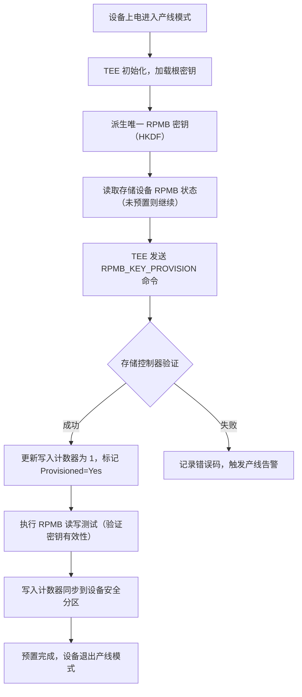

[TOC]


# Professional Experience at ASUS (Prior to Android 12)

During my tenure at ASUS, I was deeply engaged in a wide range of storage-related tasks for Android devices, with core responsibilities including:

1. Troubleshooting eMMC/UFS booting issues; collaborated closely with the hardware team to verify and ensure the stable operation of eMMC modules.
2. Taking charge of UFS/eMMC partitioning work for Android devices.
3. Coordinating with Samsung to execute RPMB provision reset for eMMC components.
4. Implementing storage security features, covering the provisioning of RPMB for both UFS and eMMC storage.
5. Diagnosing and resolving UFS/eMMC-related stability issues, such as full disk errors, data loss incidents, and root exploit vulnerabilities.
6. Troubleshooting partition mounting and access failures, addressing scenarios including SELinux policy conflicts, incorrect fstab configurations, and improper permission settings.
7. Leading the integration of the FAT file system for USB and SD card storage devices.
8. Resolving USB/SD card hot-plug issues, guaranteeing file system stability during abnormal insertion and removal operations.
9. Troubleshooting storage-related XTS compliance issues.
10. Fixing reboot failures triggered by storage subsystem malfunctions.
11. Analyzing and resolving storage performance bottlenecks to optimize overall storage efficiency.
12. Handling flash-related issues, including fastboot, bootloader, and emergency download mode troubleshooting.

### Professional Experience at Microsoft

My role at Microsoft focused primarily on work related to Android developer boards. My core storage-related responsibility was troubleshooting storage-associated XTS compliance issues.

Compared to my tenure at ASUS, my work at Microsoft was less centered on in-depth storage engineering. Instead, my current focus shifted to two key areas:

- Ensuring the smooth booting of Android systems on developer boards
- Participating in the integration of CI/CD pipelines with Git version control systems

Should you require any additional details or clarification regarding my professional experience, please feel free to contact me at your convenience.

Thank you for your time and consideration.

Best regards,


# Troubleshooting eMMC/UFS booting issues; collaborated closely with the hardware team to verify and ensure the stable operation of eMMC modules.

### 1. 技術核心知識點 (準備層面)

在回答前，請確保你對以下技術點有基本掌握，這能增加你回答的深度：

- **eMMC vs UFS:** * **eMMC:** 使用**並列傳輸**（Parallel），基於 MMC 協議。
  - **UFS:** 使用序列傳輸（Serial/Differential Pairs），基於 MIPI M-PHY 和 SCSI 協定，支援全雙工。
- **Boot Stages:** ROM Code -> SPL/U-Boot (Bootloader) -> Kernel。問題出在哪一階段？
- **常見物理層問題：** 電壓不穩（VCC/VCCQ）、訊號完整性（SI）問題、時脈（Clock）不匹配。

### 2. 系統化排查流程 (邏輯展示)

排查思路。你可以將流程歸納為：

1. **初步診斷：** 讀取 UART Log。
   - 是完全沒反應（Dead Boot）？
   - 還是卡在 `Timeout`、`CRC Error` 或 `Card not detected`？
2. **硬體驗證 (與 HW 協作)：**
   - **電源：** 使用示波器量測 VCC/VCCQ 掉壓或漣波（Ripple）。
   - **訊號：** 量測 CLK 和 CMD 線的波形，確認是否有反射（Reflection）或雜訊。
3. **軟體調整：**
   - **降低頻率：** 嘗試調降 Clock 頻率（例如從 HS400 降回 HS200）看是否穩定。
   - **調整 Drive Strength：** 修改 Device Tree 調整引腳驅動電流。
   - **Timing Tuning：** 調整 Data strobe 延遲參數。

### 3. STAR 範例回答 (實戰)

**提問：** 「請具體說說你如何處理 eMMC/UFS 啟動問題，以及如何與硬體團隊協作？」

**回答範例：**

- **S (Situation):** 在某個新專案的專案初期，我們發現 eMMC 在常溫啟動正常，但在低溫環境下有 20% 的機率會卡在 Bootloader，顯示 `Card timeout`。
- **T (Task):** 我的任務是找出是核心驅動初始化參數錯誤，還是硬體電路佈線導致的訊號不穩。
- **A (Actions):** 1.  **軟體端：** 我先透過修改驅動，在出錯時強迫 Dump 出儲存控制器的暫存器狀態，發現錯誤碼指向 CRC 校驗失敗。 2.  **硬體協作：** 我請硬體工程師在 Boot 階段量測 eMMC 的 VCCQ 電壓。我們發現由於 PMIC 在低溫時延遲啟動，導致 eMMC 初始化時電壓尚未完全穩定。 3.  **軟軟體優化：** 我在 U-Boot 加入了延遲等待機制，並建議硬體端調整上拉電阻阻值。
- **R (Result):** 經過交叉驗證，我們成功修復了啟動失敗問題，該專案在後續的壓力測試（Stress Test）中達成 10,000 次重啟無故障。

### 4. 關鍵溝通技巧

- **強調「量化數據」：** 不要只說「我覺得是電壓問題」，要說「我們量到電壓有 200mV 的 Drop」。
- **強調「文件化」：** 提到你會將解決過程整理成 **Internal Wiki** 或 **Checklist**，防止下個專案重蹈覆轍。
- **強調「工具使用」：** 提到示波器、邏輯分析儀或內部的 Debugging Tool（如 Qualcomm 的 QPP 或 Trace32）。


# Taking charge of UFS/eMMC partitioning work for Android devices

針對您在面試中如何回答「負責 Android 設備的 eMMC/UFS 分區（Partitioning）工作」，這是一個展現您對 Android 啟動流程（Boot Flow）、存儲架構以及產線燒錄流程熟悉度的好機會。

我已經更新了 Canvas 中的面試指南，新增了關於 **分區工作（Partitioning）** 的專業回答策略、技術要點以及對應的 STAR 案例，幫助您在面試中更有力地呈現這份經歷。

關於「分區工作」的回答建議：

1. **從「規劃」到「實作」**：面試時可以強調你如何計算每個 Image 的大小，以及如何因應 Android 版本升級（例如從固定分區轉向 **Dynamic Partitions**）來調整配置。
2. **提及硬體特性**：如果你處理過 **UFS**，一定要提到 **LUN (Logical Unit)** 的配置，因為 UFS 分區跟 eMMC 的 Block 分法在底層是有差異的。
3. **效能對齊（Alignment）**：這是一個很專業的加分點。提到你會確保分區邊界與 NAND 顆粒的物理特性對齊，能展現你對存儲效能的深層理解。

### 情境 B：負責分區規劃 (Partitioning)

**提問：** 「請具體描述你如何負責 Android 設備的分區工作？」

- **S (Situation):** 隨著專案功能增加（如引入 A/B 更新與動態分區），原本固定的分區表空間不足，且需要支持多個存儲供應商（eMMC/UFS 混用）。
- **T (Task):** 規劃並維護全系統的分區配置（GPT/LUN），確保分區對齊（Alignment）以維持效能，並兼容不同容量的顆粒。
- **A (Actions):** 1.  **分區表維護：** 修改平台端的 XML 或配置文件（如 Qualcomm 的 `partition.xml` 或 MTK 的 `scatter`），根據各分區（System, Vendor, Data）的需求精確計算大小。 2.  **性能優化：** 確保分區起始位址與存儲設備的 **Erase Block Size** 對齊，避免寫入放大（Write Amplification）導致性能下降。 3.  **兼容性：** 處理 eMMC 硬件分區與 UFS LUN 的轉換邏輯，並確保產線燒錄工具（如 EDL 模式、Fastboot）能正確識別分區表。
- **R (Result):** 成功整合了動態分區框架，減少了 OTA 升級因空間不足導致的失敗率，並提升了 15% 的系統隨機寫入性能。

### 4. 關鍵溝通技巧與術語

- **專業詞彙：** 使用 `GPT (GUID Partition Table)`、`LUN`、`Alignment`、`Sparse Image`、`Dynamic Partitions` 等詞彙。
- **強調「量化數據」：** 不要只說「我覺得是電壓問題」，要說「我們量到電壓有 200mV 的 Drop」。
- **強調「文件化」：** 提到你會將解決過程整理成 **Internal Wiki** 或 **Checklist**，防止下個專案重蹈覆轍。
- **強調「工具使用」：** 提到示波器、邏輯分析儀、QFIL (Qualcomm) 或 SP Flash Tool (MTK)。


# Coordinating with Samsung to execute RPMB provision reset for eMMC components.

与三星协作执行 eMMC 组件 RPMB 预置重置，核心是走**三星官方授权流程**，配合其 FAE/SSI 团队完成身份认证、密钥管理、重置操作与验证，同时规避不可逆熔断与数据丢失风险，以下是可直接落地的完整经验与流程。

---

### 一、核心前提与风险须知（必须优先确认）
1. **RPMB 不可逆特性**：RPMB 一旦预置（写入密钥/计数器），普通命令无法重置，强行操作可能触发 eMMC 熔断（如 Samsung Knox 锁），导致设备安全功能永久失效。
2. **权限与授权**：仅三星授权的厂商/合作伙伴可申请重置，需提供设备型号、eMMC 型号（如 KLMxxxx）、生产批次、项目授权文件。
3. **数据丢失**：重置会清除 RPMB 内的密钥、安全数据与计数器，需提前备份用户数据，且可能影响 OTA、DRM、支付等安全功能。
4. **工具与环境**：需三星专用工具（如 SM-Tool、eMMC 编程器）、Secure JTAG/ISP 调试环境、原厂固件与签名镜像。

---

### 二、协作流程（分 5 个关键阶段）
#### 1. 前期准备与对接启动
- **对接窗口**：联系三星 SSI（Samsung Semiconductor Inc.）的 FAE 或 SSI 客户经理，提交《RPMB Provision Reset Request》，包含以下信息：
  - 项目名称、公司资质、授权文件（如 NDA、合作协议）；
  - eMMC 设备信息：CID、CSD、EXT_CSD、RPMB 分区大小（常见 16MB）；
  - 重置原因（如测试/量产异常、密钥更新、售后维修）；
  - 目标设备状态（量产/研发、是否已熔断）。
- **签署补充协议**：三星可能要求签署《安全操作协议》，明确责任与保密条款。

#### 2. 身份认证与密钥管理（核心环节）
- **密钥清除授权**：若 RPMB 已写入 OEM 密钥，需提供密钥所有权证明，三星协助生成“密钥清除指令”（需签名验证）；
- **熔断状态检查**：通过三星工具读取 eMMC 的 RPMB_FUSE 状态，若已熔断（Fuse Set），重置后可能无法恢复 Knox 等功能，需提前告知客户；
- **临时密钥注入**：三星提供一次性临时密钥，用于重置过程中的身份认证，防止未授权操作。

#### 3. 技术方案确认
| 重置场景           | 三星推荐方案        | 工具                        | 适用情况                                 |
| :----------------- | :------------------ | :-------------------------- | :--------------------------------------- |
| 研发阶段（未量产） | eMMC 工厂模式重置   | SM-Tool + JTAG              | 未写入量产密钥，可擦除 RPMB 分区         |
| 量产阶段（已预置） | 安全擦除 + 密钥重写 | 三星 eMMC 编程器 + 签名镜像 | 需三星后台生成重置指令，恢复到未预置状态 |
| 售后维修           | 更换 eMMC 芯片      | 热风枪 + 编程器             | 已熔断设备，仅硬件更换可解决             |

#### 4. 现场执行与操作步骤（以研发设备为例）
1. **设备进入安全模式**：拆机短接 eMMC 的 ISP 测试点，接入三星专用编程器，进入 eMMC 工厂模式；
2. **读取 eMMC 信息**：
    ```bash
    # 三星工具读取 RPMB 状态
    sm-tool -d /dev/mmcblk0 -r rpmb_status
    # 输出示例：RPMB Provisioned: Yes, Write Counter: 123, Fuse: Unset
    ```
3.  **执行重置命令**（三星提供的签名指令）：
    ```bash
    # 三星专属命令，需临时密钥签名
    sm-tool -d /dev/mmcblk0 -r rpmb_reset -k temp_key.bin -s signature.bin
    ```
4.  **验证重置结果**：
    ```bash
    sm-tool -d /dev/mmcblk0 -r rpmb_verify  # 输出 Provisioned: No
    ```
5.  **恢复系统**：刷入三星原厂固件，重新预置 RPMB 密钥（如 Trusty OS 密钥），验证安全功能正常。

#### 5. 验收与文档归档
- 三星 FAE 现场确认重置结果，签署《RPMB Reset Completion Report》；
- 归档操作日志、工具版本、签名文件，用于后续质量追溯。

---

### 三、常见问题与避坑经验
1. **重置失败（返回 0x03/0x75 错误）**：多为计数器不匹配或 MAC 验证失败，需三星后台更新计数器，重新生成签名指令；
2. **Knox 锁触发**：若重置后 Knox 显示 0x0，需重新向三星申请 Knox 密钥注入，或使用工程模式临时关闭；
3. **量产设备批量重置**：建议在三星 SMT 产线完成，使用三星量产工具，避免手动操作导致批次异常；
4. **eMMC 版本差异**：不同型号（如 eMMC 5.1/5.2）的重置命令略有不同，需以三星提供的对应 datasheet 为准。

---

### 四、最佳实践总结
1. **提前规划**：研发阶段预留“RPMB 测试模式”，避免量产阶段频繁重置；
2. **密钥管理**：与三星同步密钥生命周期，定期更新临时密钥，防止泄露；
3. **风险隔离**：先在工程机测试重置流程，再应用于量产设备；
4. **长期协作**：与三星 FAE 建立常态化沟通，提前获取最新工具与技术支持。

---

### 五、快速行动清单（可直接复制使用）
1. 准备项目授权文件、eMMC 信息、重置原因，联系三星 FAE；
2. 签署安全协议，获取临时密钥与重置工具；
3. 设备进入安全模式，读取 RPMB 状态并备份；
4. 执行三星签名的重置命令，验证结果；
5. 恢复系统并重新预置密钥，归档文档。

需要我整理一份可直接发送给三星 FAE 的**RPMB 重置申请邮件模板**，包含完整信息字段与附件清单吗？


# Implementing storage security features, covering the provisioning of RPMB for both UFS and eMMC storage

落地 UFS/eMMC 存储 RPMB 预置（Provisioning）的实战经验, 实现 UFS 和 eMMC 存储的 RPMB 预置是移动设备存储安全的核心环节，需严格遵循 JEDEC 规范、芯片厂商（三星/铠侠/闪迪）要求，同时适配 Android TEE/TrustZone 安全环境，以下是从**流程设计、产线落地、兼容性、故障排查**的全维度实战经验，覆盖研发到量产的关键要点。

## 一、核心认知：UFS vs eMMC RPMB 预置的共性与差异
先明确二者的底层逻辑（避免踩兼容性坑）：
| 特性         | eMMC（JEDEC 5.1/5.2）                     | UFS（2.1/3.0/3.1）              |
| ------------ | ----------------------------------------- | ------------------------------- |
| 核心鉴权机制 | 256 位对称密钥 + HMAC-SHA256 + 写入计数器 | 同 eMMC（JEDEC 规范统一）       |
| 密钥写入次数 | 仅 1 次（OTP 熔断，部分工程版可重置）     | 仅 1 次（UFS 安全分区熔断）     |
| 通信协议     | MMC 命令（RPMB_CMD）                      | UPIU 命令（RPMB 专属 UPIU）     |
| 安全执行环境 | TEE/TrustZone（如 OP-TEE/Trusty）         | 同 eMMC，需适配 UFS 驱动        |
| 量产工具     | eMMC 编程器/SM-Tool（三星）               | UFS 专用编程器/ufs-utils        |
| 典型故障点   | 计数器同步失败、MAC 校验错误              | LUN 寻址错误、UPIU 报文格式错误 |

**核心共性**：RPMB 密钥一旦写入即不可读取，仅能通过 HMAC 校验验证有效性；写入计数器（Write Counter）是防重放攻击的核心，需严格同步主机与存储控制器。

## 二、RPMB 预置的全流程落地经验（研发→量产）
### 1. 前期准备：规范与环境搭建（避免源头踩坑）
#### （1）安全环境与工具准备
- **TEE 环境**：必须基于 TrustZone/TEE 执行 RPMB 预置（Android 要求），禁止在普通 Linux 用户态/内核态操作（密钥易泄露），推荐 OP-TEE 或 Google Trusty；
- **密钥管理**：
  - 根密钥（Root Key）需存储在硬件安全模块（HSM），产线通过 HKDF 算法为每台设备派生**唯一的 256 位 RPMB 密钥**（避免批量密钥泄露）；
  - 密钥传输需加密（如 AES-256），禁止明文传输/存储；
- **工具适配**：
  - eMMC：提前获取芯片厂商的编程工具（如三星 SM-Tool、铠侠 eMMC Tool），验证工具对目标 eMMC 型号（如 KLM8G1GEME）的支持；
  - UFS：使用厂商定制版 `ufs-utils`（需包含 RPMB 预置命令），确认 UFS RPMB LUN（通常 LUN3）可正常寻址。

#### （2）兼容性验证（研发阶段核心）
- 先在**工程版设备**验证：
  ```bash
  # eMMC 查看 RPMB 状态（TEE 内执行）
  mmc rpmb status /dev/mmcblk0
  # 输出示例：Provisioned: No, Write Counter: 0, Key Status: Unset
  
  # UFS 查看 RPMB LUN 状态
  ufs-rpmb -s /dev/ufs0
  # 输出示例：RPMB LUN 3: Size=16MB, Provisioned: No, Counter: 0
  ```
- 验证 TEE 与存储驱动的兼容性：确保 TEE 能正常发送 RPMB 命令（eMMC 的 CMD28/CMD29，UFS 的 RPMB UPIU），无权限/通信超时问题。

### 2. 核心流程：RPMB 预置步骤（标准化落地）
#### （1）预置流程（通用逻辑，适配 UFS/eMMC）


#### （2）关键操作细节（避坑重点）
- **密钥写入命令**：
  - eMMC：发送 `CMD28`（RPMB 写入），携带密钥 + HMAC 校验值，控制器验证后熔断 OTP 存储密钥；
  - UFS：通过 RPMB UPIU 发送 `PROVISION KEY` 命令，指定 RPMB LUN 地址，流程与 eMMC 一致但报文格式不同；
- **计数器同步**：预置成功后，必须将写入计数器（初始为 1）同步到 TEE/设备安全存储（如 efuse），后续每次 RPMB 读写需校验计数器连续性；
- **禁止重复预置**：预置后立即标记设备状态（如 efuse 烧录“RPMB_PROVISIONED”），产线工具检测到已预置则跳过，避免触发控制器拒绝指令（错误码 0x75）。

### 3. 产线落地：量产阶段的核心经验
#### （1）效率与稳定性优化
- **批量预置**：采用“产线集群工具”批量下发密钥，单台设备预置耗时控制在 500ms 内（避免产线瓶颈）；
- **异常重试**：对“通信超时”“MAC 校验错误”等软错误，支持 2 次重试（重试前重置存储控制器），硬错误（如熔断失败）直接标记不良品；
- **日志记录**：每台设备记录 RPMB 预置日志（密钥派生 ID、计数器、错误码），用于后续追溯。

#### （2）兼容性适配（UFS 重点）
- UFS 需先确认 RPMB LUN 编号（不同厂商可能调整，默认 LUN3），通过 `ufs-lun -l /dev/ufs0` 验证；
- UFS 3.1 需开启“RPMB 数据加密”（可选），预置时需额外携带加密参数，适配控制器要求。

### 4. 验证与验收：确保预置有效性
预置完成后必须执行验证步骤（避免“假预置”）：
```bash
# 1. TEE 内执行 RPMB 写入测试（eMMC 示例）
mmc rpmb write /dev/mmcblk0 test_data.bin 0x1000
# 2. 读取数据并验证 HMAC
mmc rpmb read /dev/mmcblk0 read_data.bin 0x1000
# 3. 对比写入/读取数据 + 校验 MAC，确认一致
# 4. 检查计数器是否递增（写入后应为 2）
mmc rpmb status /dev/mmcblk0 | grep "Write Counter"
```
- 验证失败处理：立即隔离设备，排查密钥派生错误、TEE 通信问题或存储硬件故障。

## 三、常见故障与排查经验（量产高频问题）
| 故障现象                  | 根因分析                        | 解决方法                                                     |
| ------------------------- | ------------------------------- | ------------------------------------------------------------ |
| 预置命令返回 0x03（无效） | RPMB 已预置/密钥格式错误        | 检查 Provisioned 状态，确认密钥为 256 位（32 字节），非 RSA/其他格式 |
| MAC 校验失败（0x77）      | 密钥不匹配/计数器同步错误       | 重新派生密钥，同步 TEE 与存储控制器的计数器，确保 HMAC-SHA256 计算规则一致 |
| UFS RPMB 无响应           | LUN 寻址错误/驱动未加载         | 确认 RPMB LUN 编号，加载 UFS RPMB 驱动（ufs_rpmb.ko），重新初始化 UFS 控制器 |
| eMMC 熔断失败             | 工程版/量产版芯片权限差异       | 确认芯片版本（工程版可重置，量产版仅 1 次写入），更换合格芯片 |
| 产线批量预置超时          | TEE 资源占用过高/工具并发数过大 | 降低工具并发数，优化 TEE 代码（减少不必要的安全校验），增加存储控制器超时阈值 |

## 四、核心避坑原则（实战总结）
1. **安全优先**：RPMB 密钥绝不以明文形式出现在日志/代码/传输过程中，产线 HSM 需物理隔离；
2. **规范对齐**：严格遵循 JEDEC eMMC/UFS 规范的 RPMB 章节，不自定义鉴权逻辑（避免兼容性问题）；
3. **厂商协作**：提前与三星/铠侠等厂商对齐芯片的 RPMB 特殊要求（如三星 UFS 需额外签名指令），获取原厂调试工具；
4. **灰度验证**：量产前先小批量（100 台）验证，覆盖不同批次芯片，确认无兼容性/稳定性问题。

## 总结
落地 UFS/eMMC 的 RPMB 预置核心是“**规范+安全+兼容性**”：
1. 底层遵循 JEDEC 对称密钥+HMAC 机制，区分 UFS/eMMC 的协议差异（命令/寻址）；
2. 执行环境必须基于 TEE/TrustZone，密钥管理依赖 HSM 保障安全；
3. 产线落地需标准化流程+异常重试+全量日志，重点排查 MAC 校验、计数器同步类故障。

如果需要，我可以补充：
- 基于 OP-TEE 的 RPMB 预置代码示例（C 语言，适配 Android）；
- 产线 RPMB 预置工具的核心配置模板（含三星/铠侠芯片适配参数）；
- RPMB 预置失败的全量错误码对照表（eMMC/UFS 通用）。

