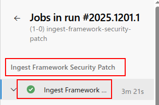

# ingest-framework-security-patch


[TOC]


## Overview

- Parse the SPL package and identify repos that need to be created in the mdep project.
- Pipeline
  - [(1-0) ingest-framework-security-patch](https://dev.azure.com/ampx/415ef6b4-62b1-4640-87ac-20f7c497e53f/_build?definitionId=1647&_a=summary)/[2025.1201.1](https://dev.azure.com/ampx/415ef6b4-62b1-4640-87ac-20f7c497e53f/_build/results?buildId=1956295)


## Code Study - stage: ingestFrameworkSecurityPatch

- security_patch/scripts/security_patch/yaml/ingest_framework_security_patch.yaml

  ```
      stages:
      - stage: ingestFrameworkSecurityPatch
        displayName: "Ingest Framework Security Patch"
        dependsOn: []
        jobs:
        - job: ingestFrameworkSecurityPatch
          displayName: "Ingest Framework Security Patch"
          timeoutInMinutes: 10
          workspace:
            clean: all      
  ```

  - workspace - clean: all
    - 在 job 開始前清除整個 Pipeline.Workspace，下方所有目錄（如 `s`, `b`, `a`, artifacts, test results…）全部刪除。




## Code Study - template: /private/templates/ado-cloud-setup.yaml@build_core

-   scripts/security_patch/yaml/ingest_framework_security_patch.yaml

  **用來下載本身(codebase_util)及build.core**
  
  ```
  resources:
    repositories:
  :
      - repository: build_core
        type: git
        name: tooling/build.core
        ref: 'refs/heads/main'  
  :
      - stage: ingestFrameworkSecurityPatch
  :
          steps:
            - template: /private/templates/ado-cloud-setup.yaml@build_core
  ```
  
  - 作用: 在该 job 的 `steps` 中内联并执行一个通用的步骤模板，作为首个初始化步骤，为后续步骤提供统一的环境/工具配置。
  - 模板来源: 来自资源库别名 `build_core`（在 [ingest_framework_security_patch.yaml](vscode-file://vscode-app/usr/share/code/resources/app/out/vs/code/electron-browser/workbench/workbench.html) 的 `resources.repositories` 中定义 `repository: build_core` → `name: tooling/build.core`）。路径为该仓库根下的 `/private/templates/ado-cloud-setup.yaml`。


## Code Study - Download Security Patch

- scripts/security_patch/yaml/ingest_framework_security_patch.yaml

  ```
            - task: UniversalPackages@0
              displayName: "Download Security Patch"
              retryCountOnTaskFailure: 5
              inputs:
                command: 'download'
                downloadDirectory: '$(System.DefaultWorkingDirectory)'
                feedsToUse: 'internal'
                vstsFeed: $(securityPatchFeedName)
                vstsFeedPackage: $(securityPatchPackage)
                vstsPackageVersion: ${{ parameters.securityPatchVersion }}
                verbosity: 'debug'
  ```

  - 這是一個 Azure Pipelines `UniversalPackages@0` 任務，用來從內部 feed 下載安全補丁包。

  - `displayName` 與 `retryCountOnTaskFailure: 5`：顯示任務名稱，下載失敗時最多重試 5 次。

  - `inputs.command: download`：執行下載模式。

  - `downloadDirectory: $(System.DefaultWorkingDirectory)`：將包下載到預設工作目錄，供後續腳本使用。

    - 在 Azure DevOps (ADO) Pipeline 中，`System.DefaultWorkingDirectory` 是**核心内置系统变量**，用于标识当前 Job 运行时的**默认工作目录**（Agent 代理机上的本地路径），所有步骤（`step`）的操作默认基于该目录展开，是 ADO 流水线中文件操作、路径引用的核心基准。

  - `feedsToUse: internal`：使用 ADO 內部 feed。

  - `vstsFeed: $(securityPatchFeedName)`、`vstsFeedPackage: $(securityPatchPackage)`：分別指定 feed 名稱與包名（前面變數區定義 `securityPatchPackage: android-security-bulletin`）。

    - scripts/security_patch/yaml/template/common_vars.yaml

      ```yaml
        - name: securityPatchFeedName
          value: 'security-patch'
      ```

    - scripts/security_patch/yaml/ingest_framework_security_patch.yaml

      ```yaml
        - name: securityPatchPackage
          value: 'android-security-bulletin'
      ```

  - `vstsPackageVersion: ${{ parameters.securityPatchVersion }}`：從參數取得欲下載的補丁版本。

    - scripts/security_patch/yaml/ingest_framework_security_patch.yaml

      在run pipeline前輸入security-patch/android-security-bulletin　的版本.　這版本是由google storage下載後自行publish上去的.

      ```
      parameters:
      :
      - name: securityPatchVersion
        displayName: "Security Patch Artifact Version"
        default: ""
        type: string
      ```

  - `verbosity: debug`：提高日誌詳盡度，便於追蹤下載細節與問題。


##　Code Study - RepoManifestRetriever.py

- overview

  目的: 以 Google `repo` 工具從指定 manifest 倉庫與分支產出「合併後的 manifest」檔案，並放到指定輸出位置

  - 沒指定則放$(repoRoot)/$(artifactOutputPath)/merge.xml

- scripts/security_patch/yaml/ingest_framework_security_patch.yaml

  ```yaml
      stages:
      - stage: ingestFrameworkSecurityPatch
        displayName: "Ingest Framework Security Patch"
        :
            - script: |
                bash $(repoRoot)/$(securityPatchPipelineRootDir)/security_patch_script_launcher.sh "./util/RepoManifestRetriever.py" \
                    --working_path "$(repoRoot)/$(artifactOutputPath)" \
                    --manifest_url "${{ parameters.manifestUrl }}" \
                    --manifest_branch "${{ parameters.manifestBrnach }}" \
                    --manifest_name "${{ parameters.manifestName }}" \
                    --token "$AZURE_DEVOPS_EXT_PAT" \
                    --delete_existing_working_path
              displayName: "Download and Merge the Manifest"     
  ```

  - artifactOutputPath

    - \- template: /scripts/security_patch/yaml/template/common_vars.yaml

      ```yaml
      variables: 
        - name: artifactOutputPath
          value: 'artifact'
      ```

  - parameters.manifestUrl, parameters.manifestBrnach & parameters.manifestName

    - scripts/security_patch/yaml/ingest_framework_security_patch.yaml

      ```yaml
      parameters:
      - name: manifestUrl
        displayName: "HTTP URL for Manifest (e.g. https://dev.azure.com/ampx/mdep/_git/manifest.mdep)"
        type: string
        default: ""
      
      - name: manifestBrnach
        displayName: "Manifest Branch (e.g. ssi/12/1202/main)"
        type: string
        default: ""
        
      - name: manifestName
        displayName: "Manifest Name (optional)"
        default: " "
        type: string  
      ```

      - manifestBrnach 如**mdep/13/1303.1/main**


## Code Study - OsVerDetector.py

- overview

  偵測Android版本,　並設至androidVer,　**同一job內可用$(androidVer)取用**

- scripts/security_patch/yaml/ingest_framework_security_patch.yaml

  ```
            - script: |
                bash $(repoRoot)/$(securityPatchPipelineRootDir)/security_patch_script_launcher.sh "./util/OsVerDetector.py" \
                    --working_path "$(repoRoot)/$(artifactOutputPath)" \
                    --aosp_build_repo_path "$(repoRoot)/build" \
                    --output_variable_name 'androidVer' \
                    --override_os_ver '${{ replace(parameters.androidVersion, 'Auto-Detect', '') }}'
              displayName: "Detect the OS Version"
  ```

  - parameters.androidVersion

    - scripts/security_patch/yaml/ingest_framework_security_patch.yaml

      ```yaml
      parameters:
      :
      - name: androidVersion
        displayName: "Android Version"
        type: string
        default: "Auto-Detect"
        values:
          - "Auto-Detect"
          - "11"
          - "12L"
          - "13"
          - "15"
      ```


## Code Study - ingest_framework_security_patch.py

- Overview

  這支 Python 腳本負責從 Android Security Bulletin 套件中提取、分類與**匯出** Framework 安全補丁（patches），並根據當前 codebase 的 manifest 篩選適用的儲存庫（repo）、生成後續流程所需的**元資料**。 
  
  - **若專案不在目標 ADO project 清單 → 排除（並記錄警告）**
  - **排除的資料夾移至 `excluded_patches/` 並產生 [EXCLUDED_PATCH_INFO_JSON](vscode-file://vscode-app/usr/share/code/resources/app/out/vs/code/electron-browser/workbench/workbench.html)**
  
- scripts/security_patch/yaml/ingest_framework_security_patch.yaml

  ```yaml
      stages:
      - stage: ingestFrameworkSecurityPatch
        displayName: "Ingest Framework Security Patch"
        :
            - script: |
                bash $(repoRoot)/$(securityPatchPipelineRootDir)/security_patch_script_launcher.sh "./ingest_framework_security_patch.py" \
                    --os_ver "$(androidVer)" \
                    --security_patch_path "$(System.DefaultWorkingDirectory)" \
                    --target_ado_projects "${{ parameters.targetAdoProject }}" \
                    --output "$(repoRoot)/$(artifactOutputPath)" \
                    --ignore_error "${{ lower(parameters.ignoreError) }}"
              displayName: "Check and Export Framework Security Patches"      
  ```

  - scripts/security_patch/ingest_framework_security_patch.py


## Log Study - download codebase_util

- log

  ```
  2025-12-02T09:14:33.1945294Z Fetching default branch for repo.
  2025-12-02T09:14:33.1948144Z URI: https://dev.azure.com/ampx/ Repo: codebase_util RepositoryId: aa681a86-465f-420a-b25d-28a988d4b2e9
  2025-12-02T09:14:33.9715669Z @{id=aa681a86-465f-420a-b25d-28a988d4b2e9; name=codebase_util; url=https://dev.azure.com/ampx/415ef6b4-62b1-4640-87ac-20f7c497e53f/_apis/git/repositories/aa681a86-465f-420a-b25d-28a988d4b2e9; project=; defaultBranch=refs/heads/main; size=10484119; remoteUrl=https://ampx@dev.azure.com/ampx/tooling/_git/codebase_util; sshUrl=git@ssh.dev.azure.com:v3/ampx/tooling/codebase_util; webUrl=https://dev.azure.com/ampx/tooling/_git/codebase_util; _links=; isDisabled=False; isInMaintenance=False}
  2025-12-02T09:14:33.9736273Z Set default branch to: refs/heads/main
  2025-12-02T09:14:33.9750234Z Current branch is refs/heads/security_patch
  ```

- codebase_util

  - security_patch/scripts/security_patch/yaml/template/common_vars.yaml

    ```yaml
    variables: 
      :
      - name: repoRoot
        value: '$(Build.SourcesDirectory)/codebase_util'
    ```

  - job: ingestFrameworkSecurityPatch

    ```yaml
        - stage: ingestFrameworkSecurityPatch
    :
            steps:
              - template: /private/templates/ado-cloud-setup.yaml@build_core
              - checkout: self
              - template: /scripts/code_integration/yaml/templates/python_venv_setup.yaml@self
                parameters:
                  pythonRootDir: '$(repoRoot)/scripts/code_integration'
              - script: |
                  # Install the repo command
                  curl https://storage.googleapis.com/git-repo-downloads/repo > ~/.local/bin/repo
                  chmod a+x ~/.local/bin/repo
                displayName: "Install repo"
              - task: UniversalPackages@0
                displayName: "Download Security Patch"
                retryCountOnTaskFailure: 5
                inputs:
                  command: 'download'
                  downloadDirectory: '$(System.DefaultWorkingDirectory)'
                  feedsToUse: 'internal'
                  vstsFeed: $(securityPatchFeedName)
                  vstsFeedPackage: $(securityPatchPackage)
                  vstsPackageVersion: ${{ parameters.securityPatchVersion }}
                  verbosity: 'debug'
    ```

    


## Log Study - repo init manifest

- log

  (1-0) ingest-framework-security-patch/[2025.1201.1](

  ```
  2025-12-02T09:15:59.7127642Z [2025-12-02 09:15:59][INFO] Start to retrieve the merged manifest
  2025-12-02T09:15:59.7132062Z [2025-12-02 09:15:59][INFO] Init repo with command: repo init -u https://dev.azure.com/ampx/mdep/_git/manifest.mdep -b mdep/13/1303.1/main
  ```

  - scripts/security_patch/util/RepoManifestRetriever.py

    ```
    if __name__ == '__main__':
    :
        SimpleLogger.logger.info('Start to retrieve the merged manifest')
    ```

    - - -

