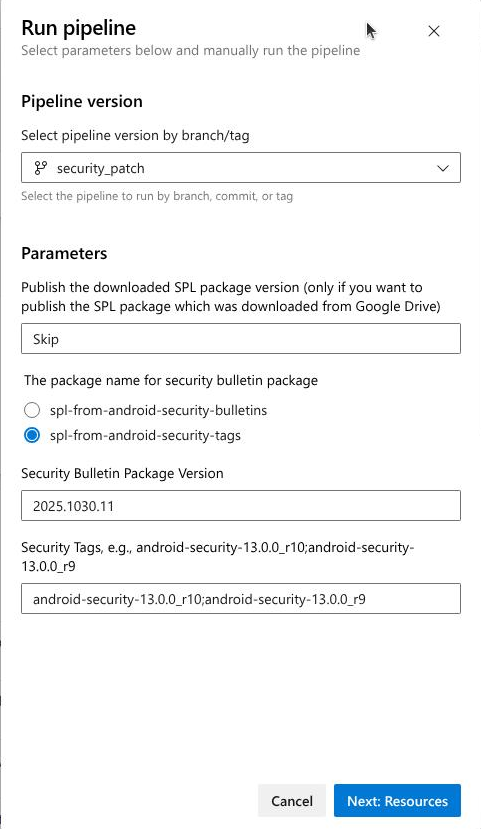

# download_spl_from_android_manifest.yaml


## Overview

- [(0-1) download-spl-from-maniests](https://dev.azure.com/ampx/415ef6b4-62b1-4640-87ac-20f7c497e53f/_build?definitionId=9587&_a=summary)

  - 這是一個 **Azure DevOps Pipeline**，用於從 Android Manifest 生成安全補丁，並與 Security Bulletin 補丁進行整合。

  - **主要功能**

    提供兩種模式來處理 Android 安全補丁：

    - **重新發布模式**：直接發布已下載的 SPL 包
      - 由android-security-bulletin artifact 取出版本後再由pipeline發佈
    - **生成整合模式**：從 manifest 生成新補丁，並與 security bulletin 補丁整合


## Reference

- security-patch feed
  - android-security-bulletin 
    - [2025.1201.2](https://dev.azure.com/ampx/mdep/_artifacts/feed/security-patch/UPack/android-security-bulletin/overview/2025.1201.2)
      - 手動
  - spl-from-android-security-bulletins
    - pipeline
  - spl-from-android-security-tags
    - pipeline


## Flow

- [security-patch](https://dev.azure.com/ampx/mdep/_artifacts/feed/security-patch)

  - spl-from-android-security-bulletins

    - [2025.1028.1](https://dev.azure.com/ampx/mdep/_artifacts/feed/security-patch/UPack/spl-from-android-security-bulletins/overview/2025.1028.1)
      - [(0-0) download-spl-package](https://dev.azure.com/ampx/415ef6b4-62b1-4640-87ac-20f7c497e53f/_build?definitionId=8106&_a=summary)/[2025.1028.1](https://dev.azure.com/ampx/415ef6b4-62b1-4640-87ac-20f7c497e53f/_build/results?buildId=1798505)

  - spl-from-android-security-tags 

    - [2025.1030.10](https://dev.azure.com/ampx/mdep/_artifacts/feed/security-patch/UPack/spl-from-android-security-tags/overview/2025.1030.10)

      - [(0-1) download-spl-from-maniests](https://dev.azure.com/ampx/415ef6b4-62b1-4640-87ac-20f7c497e53f/_build?definitionId=9587&_a=summary)/[2025.1030.10](https://dev.azure.com/ampx/415ef6b4-62b1-4640-87ac-20f7c497e53f/_build/results?buildId=1809249)

        - download from spl-from-android-security-bulletins

          ```
          2025-10-30T08:15:04.5822358Z Downloading package: spl-from-android-security-bulletins, version: 2025.1028.1 using feed id: security-patch, project: null
          2025-10-30T08:15:04.5840160Z /mnt/vss/_work/_tool/artifacttool/0.2.488/x64/artifacttool universal download --feed security-patch --service https://dev.azure.com/ampx/ --package-name spl-from-android-security-bulletins --package-version 2025.1028.1 --path /mnt/vss/_work/1/s/codebase_util/splBulletinDownload --patvar UNIVERSAL_DOWNLOAD_PAT --verbosity Error --filter **
          ```

          - 也可以由前一版spl-from-android-security-tags 下載.

        - publish
        
          ```
          2025-10-30T08:17:04.1008023Z Publishing package: spl-from-android-security-tags, version: 2025.1030.10 using feed id: 28e0e6ce-83a9-7b36-ba2d-217653dc749c, project: null
          2025-10-30T08:17:04.1012090Z /mnt/vss/_work/_tool/artifacttool/0.2.488/x64/artifacttool universal publish --feed 28e0e6ce-83a9-7b36-ba2d-217653dc749c --service https://dev.azure.com/ampx/ --package-name spl-from-android-security-tags --package-version 2025.1030.10 --path /mnt/vss/_work/1/s/codebase_util/spl_from_android_manifest/results --patvar UNIVERSAL_PUBLISH_PAT --verbosity None --description Get SPL package between tags: android-security-13.0.0_r10;android-security-13.0.0_r9
          ```
        
          


## Artifacts

- spl-from-android-security-tags [2025.1031.1](https://dev.azure.com/ampx/mdep/_artifacts/feed/security-patch/UPack/spl-from-android-security-tags/overview/2025.1031.1)

  - 
    Pipelines/(0-1) download-spl-from-maniests/[2025.1031.1](https://dev.azure.com/ampx/tooling/_build/results?buildId=1813347&view=results)

  


## parameters


## task

- ${{ if ne(parameters.splPackageVersion, 'Skip') }}:

  ```yaml
            - ${{ if ne(parameters.splPackageVersion, 'Skip') }}:
              - task: DownloadPackage@1
                inputs:
                  packageType: 'upack'
                  feed: '$(securityPatchFeedName)'
                  definition: '$(splPackageName)'
                  version: '${{ parameters.splPackageVersion }}'
                  downloadPath: '$(repoRoot)/$(splBulletinDownloadPath)'
                displayName: 'Download SPL Package ${{ parameters.splPackageVersion }} from Feed $(securityPatchFeedName)'
  
  ```

  - **Purpose:** This downloads a previously published SPL (Security Patch Level) package from the artifact feed, allowing users to republish an existing package version instead of generating a new one from scratch. It only executes when `splPackageVersion` parameter is not set to "Skip".
  - Inputs
    - **`packageType: 'upack'`** - Specifies Universal Package format
    - **`feed: '$(securityPatchFeedName)'`** - **Downloads** from the "**security-patch**" feed
    - **`definition: '$(splPackageName)'`** - Package name is "**android-security-bulletin**"
    - **`version: '${{ parameters.splPackageVersion }}'`** - Uses the version specified when the pipeline runs (user parameter)
    - **`downloadPath: '$(repoRoot)/$(splBulletinDownloadPath)'`** - Saves to the `splBulletinDownload` directory in the repo root

-  \- ${{ if eq(parameters.splPackageVersion, 'Skip') }}:

  ```yaml
            - ${{ if eq(parameters.splPackageVersion, 'Skip') }}:
              - script: |
                  bash $(repoRoot)/$(securityPatchPipelineRootDir)/security_patch_script_launcher.sh "generate_security_patch_by_manifest.py" \
                      --security_tags "${{ parameters.securityTags }}" \
                      --output_dir "$(repoRoot)/$(splManifestOutputPath)"
                displayName: "Create Security Patches By Manifest"
              - task: DownloadPackage@1
                inputs:
                  packageType: 'upack'
                  feed: '$(securityPatchFeedName)'
                  definition: '$(securityBulletinPackageName)'
                  version: '${{ parameters.securityBulletinPackageVersion }}'
                  downloadPath: '$(repoRoot)/$(splBulletinDownloadPath)'
                displayName: 'Download New Package ${{ parameters.securityBulletinPackageVersion }} from Feed $(securityPatchFeedName)'
              - script: |
                  echo "Replace the patch directory: $(ANDROID_SECURITY_PATCH_DIR)"
                  bash $(repoRoot)/$(securityPatchPipelineRootDir)/security_patch_replacement.sh \
                      "$(repoRoot)/$(splBulletinDownloadPath)" \
                      "$(repoRoot)/$(splManifestOutputPath)/results" \
                      "$(ANDROID_SECURITY_PATCH_DIR)"
                displayName: "Replace SPLs in Security Bulletin with SPLs from Manifest"
              - task: 1ES.PublishPipelineArtifact@1
                inputs:
                  artifactName: 'Security_Manifest_Package'
                  targetPath: $(repoRoot)/$(splManifestOutputPath)/results
                condition: always()
                displayName: 'Publish Pipeline Artifact for SPL from Manifest'
              - task: 1ES.PublishPipelineArtifact@1
                inputs:
                  artifactName: 'New_Security_Bulletin_Package'
                  targetPath: $(repoRoot)/$(splBulletinDownloadPath)
                condition: always()
                displayName: 'Publish Pipeline Artifact for New Security Bulletin Package'
              - task: UniversalPackages@0
                inputs:
                  command: publish
                  publishDirectory: $(repoRoot)/$(splBulletinDownloadPath)
                  vstsFeedPublish: $(securityPatchFeedName)
                  vstsFeedPackagePublish: "$(splFromSecurityTagsPackageName)"
                  packagePublishDescription: 'Get SPL package between tags: ${{ parameters.securityTags }}'
                  versionOption: custom
                  versionPublish: $(Build.BuildNumber)
                displayName: 'Publish Artifacts To Feed $(securityPatchFeedName)'
  ```

  

## 說明 download_spl_from_android_manifest.yaml

這是一個 **Azure DevOps Pipeline**，用於從 Android Manifest 生成安全補丁，並與 Security Bulletin 補丁進行整合。

### **主要功能**

提供兩種模式來處理 Android 安全補丁：

1. **重新發布模式**：直接發布已下載的 SPL 包
2. **生成整合模式**：從 manifest 生成新補丁，並與 security bulletin 補丁整合

### **輸入參數**

- **`splPackageVersion`**

  - 版號 
    - 要重新發布的 SPL 包版本
      - [security-patch](https://dev.azure.com/ampx/mdep/_artifacts/feed/security-patch)/android-security-bulletin
  - "Skip" 
    - Security Bulletin 包名稱
      - [security-patch](https://dev.azure.com/ampx/mdep/_artifacts/feed/security-patch)/spl-from-android-security-bulletins
      - [security-patch](https://dev.azure.com/ampx/mdep/_artifacts/feed/security-patch)/spl-from-android-security-tags

- `securityBulletinPkgName`

  - `splPackageVersion` Skip case
  - Security Bulletin 包名稱
    - `spl-from-android-security-bulletins`（從(0-0) download-spl-package pipeline 產生的feed 來.）
    - `spl-from-android-security-tags`（從[(0-1) download-spl-from-maniests](https://dev.azure.com/ampx/415ef6b4-62b1-4640-87ac-20f7c497e53f/_build?definitionId=9587&_a=summary) 產生的feed 來）

- **`securityBulletinPackageVersion`**: 

  - Security Bulletin 包版本號

- **`securityTags`**: 

  - Skip case

  - 兩個安全標籤，用分號分隔（例如：`android-security-13.0.0_r10;android-security-13.0.0_r9`）

    

### **工作流程**

#### **模式 1: 重新發布已有的 SPL 包** (`splPackageVersion != "Skip"`)

```
1. 下載指定版本的 SPL 包
2. 發布為 Pipeline Artifact
3. 重新發布到 Feed（新包名：android-spl-bulletin-publish）
```

**用途**：當需要將某個已存在的 SPL 包以新名稱重新發布時使用。

#### **模式 2: 從 Manifest 生成並整合補丁** (`splPackageVersion == "Skip"`)

##### **步驟 1: 從 Manifest 生成補丁**

```
generate_security_patch_by_manifest.py \
    --security_tags "android-security-13.0.0_r10;android-security-13.0.0_r9" \
    --output_dir "spl_from_android_manifest"
```

- 比較兩個安全標籤之間的差異
- 從 AOSP manifest 提取所有變更的專案
- 生成補丁文件到 `spl_from_android_manifest/results/`
- **設定環境變數** `ANDROID_SECURITY_PATCH_DIR`（例如：`android-13.0.0_r1`）

##### **步驟 2: 下載 Security Bulletin 包**

```
- task: DownloadPackage@1
  definition: '$(securityBulletinPackageName)'  # 從參數選擇來源
  version: '2025.1028.1'
```

下載從 Android 安全公告網站爬取的補丁包到 `splBulletinDownload/`

##### **步驟 3: 替換和整合補丁**

```
security_patch_replacement.sh \
    "splBulletinDownload" \          # Bulletin 補丁（來源）
    "spl_from_android_manifest/results" \  # Manifest 補丁（優先）
    "android-13.0.0_r1"              # 目標目錄
```

**整合邏輯**：

- 以 **Manifest 生成的補丁為準**（更準確）
- 用 Manifest 補丁 **替換** Security Bulletin 中對應的補丁
- 保留 Bulletin 中 Manifest 沒有的補丁
- 結果保存回 `splBulletinDownloadPath/`

##### **步驟 4: 發布整合後的補丁**

```
- Artifact 1: Security_Manifest_Package (僅 Manifest 補丁)
- Artifact 2: New_Security_Bulletin_Package (整合後的完整補丁)
- 發布到 Feed: spl-from-android-security-tags
```

### **整合邏輯圖**

```
Security Bulletin 補丁           Manifest 生成的補丁
(從網站爬取)                    (從 Git 標籤比較)
        │                              │
        ├─ platform/frameworks/base/   ├─ platform/frameworks/base/
        │  └─ 0001-fix.patch          │  └─ 0001-fix-v2.patch ✓ (優先)
        │                              │
        ├─ platform/system/core/       ├─ platform/system/core/
        │  └─ 0001-sec.patch          │  └─ 0001-sec-v2.patch ✓
        │                              │
        ├─ platform/external/xyz/      │ (沒有這個)
        │  └─ 0001-update.patch ✓     │
        │                              │
        └───────────┬──────────────────┘
                    ↓
            整合後的最終補丁包
         (Manifest 優先 + Bulletin 補充)
```

### **輸出產物**

- **Package 名稱**: `spl-from-android-security-tags`

- **版本號**: `$(Build.BuildNumber)` (例如：`2025.1201.1`)

- 內容

  : 整合後的完整補丁集，包含：

  - Manifest 提取的所有補丁（主要來源）
  - Security Bulletin 中額外的補丁（補充）

### **使用場景**

當 Google 發布新的安全標籤時：

1. 使用此 pipeline 從標籤生成準確的補丁
2. 與之前從 Security Bulletin 爬取的補丁進行整合
3. 產出一個完整且準確的安全補丁包，供後續 Android 建置使用
